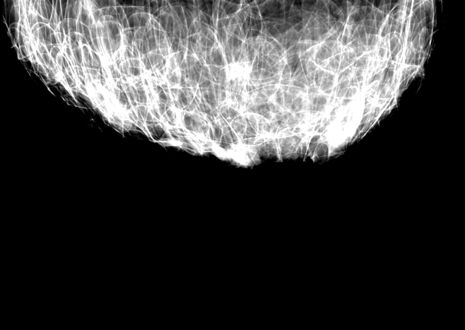

# Projects

## Deep Learning Based Digital Breast Tomosynthesis Reconstrction
I developed a [new tool](https://github.com/daviduarte/DeepLearningDBT) to generate Digital Breast Tomosynthesis images from a set of projections. This software is the result of my master thesis. I implemented the well-known algorithm in the medical imaging litarature named Filtered Backprojection in the form of a Neural Network layer, using Tensorflow. For that, I had to create a new operation in Tensorflow, using its low-level API. I used GPU to became this operation efficient (using CUDA Kernels). In this project, I worked directly with Deep Learning, Tensorflow (efficient operations implementations using GPGPU), theorical computer vision concepts like image processing, image synthesis, projection matrices and noise filtering.

## CamNuvem - Artificial Inteligence Based Video Surveillance
[In this project](https://camnuvem.com.br) I developed an online platform that allows users connect their surveillance cameras to have their images stored in the cloud and analyzed in real-time by Artificial Intelligence, that notify them in WhatsApp if someone ou something exceed a predetermined perimeter in the camera. This tool was tested with real customers and proved to be functional. I used Tensorflow and a pre-treined object detection model. I used a parallel thread to run the object detection model to efficiently process the hundreds of frames per second that customers cameras place in a FIFO.

## CamNuvem Distributed Inference
In the CamNuvem, experiments showed that use multiple simple Virtual Machines (VM) (like 10 VMs with 1 vCPU without GPU) is cheaper than use a more robust machine (like a VM with GPU), taking into account a pre-treined and non-quantized object detection model. Thus, I developed [this project](https://github.com/daviduarte/distributed_inference), that distributes a object detection model into a heterogeneous devices network for inference (using Tensorflow), making possible lower the price of Image Analyze in CamNuvem. In this project, I used distributed computation concepts, like Lamport's Logical Clock (for sync the frames of cameras) in a client-server architecture in addition to process intercommunication libraries (like ZeroMQ).

## Data Analysis in Motocycles Ads
In this project, I implement a Web Scrapper and a Linear Regression Model to analyse the motocycle classified ads in the OLX.com.br (platform widely used in Brazil) to find good deals. The construction of this tool is [detailed here](https://medium.com/ensinando-m%C3%A1quinas/coleta-e-an%C3%A1lise-de-dados-de-motos-no-olx-6d0fd914853b).

## Ensinando Máquinas
This is my YouTube channel where I develop interesting computing projects and talk about tech subjects. 

## IA based Snake Game 
In this project, I implement the Snake Game that plays automatically. I used a Fully Connected Artificial Neural Network (FCANN) as the model and Genetic Algorithm to find the best weights of the FCANN. The result and more details can be found in my [YouTube channel](https://youtu.be/0WVAWjVOygE)

### Piano Tiles BOT

